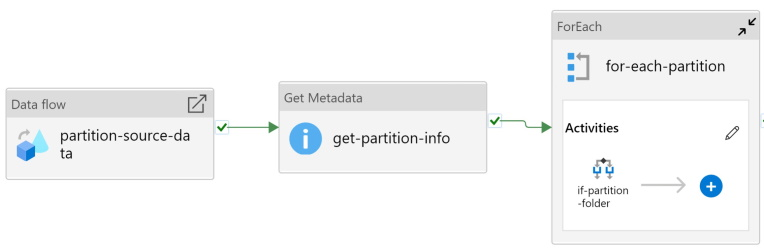
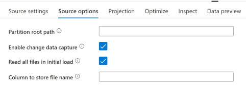
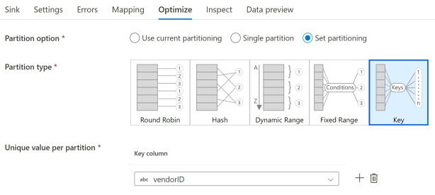
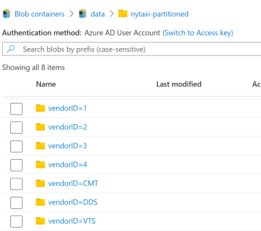
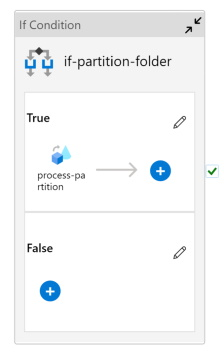
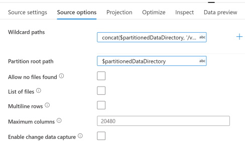
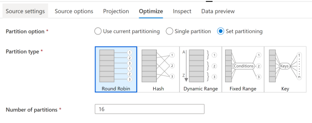

# Pre-partitioning Source Data in an Azure Data Factory Dataflow

## Overview

This pattern can be useful in scenarios where large datasets with "wide" rows and complex aggregations/joins, etc. cause excessive memory pressure on the driver and/or executor nodes. This can result in out of memory exceptions in Spark and therefore Data flow failures. This pattern attempts to alleviate this issue by paritioning source data in advance in order to "fan out" Data flow execution to multiple independent Spark clusters. 

The simplest example of this pattern being used in a Pipeline conists of the following Activities:

1. A Data flow Activity that "pre-partitions" source data and stages it for downstream processing.
2. A Get Metadata Activity to gather information on the output from the Data flow.
3. A ForEach Activity to iterate over the resulting partition folders/files.
4. An If Condition Activity to restrict further processing to only partition files.
5. A Data flow Activity to perform the necessary ETL operations.

The implementation details of each Activity will vary based on the partition type chosen in the first Data flow's sink. The walkthrough below demonstrates the pattern using a key-based partition type. The source code in this repo contains both the key-based approach as well as an implementation that uses round robin parititioning. 

Here is what the Pipeline looks like at the highest level:

The "partition-source-data" dataflow is very straightforward. The only "interesting" thing is that we've enabled change data capture to avoid continually reloading the nytaxi source data as we iterate on the rest of the pipeline development.

The sink is slighting more interesting in that we set the partitition type in the optimize tab. We've chosen vendorID in this case, even though it produces somewhat skewed partitions due to the nature of the nytaxi dataset. More information about how choose a partitioning type can be found here: [Mapping data flows performance and tuning guide](https://learn.microsoft.com/en-us/azure/data-factory/concepts-data-flow-performance#optimize-tab). A solid understanding of your data and/or thorough performance testing is essential to choosing the most effective partitioning approach.

Running the pipeline through this first Data flow with these settings will produce a folder per partition, named using the value of the vendorID key.

The Get metadata activity will retrieve the resulting list of Child Items and the ForEach activity will loop over the resulting items using the following expression: `@activity('get-partition-info').output.childItems` and the nested If Condition activity will filter down to just the folders using this expression: `@equals(item().type, 'Folder')`. This way we don't try to also process the _SUCCESS file that's emitted by Spark.

Now the Data flow that contains the actual business logic can be executed in parallel against each of the resulting partitions. In the example here, there's really no "business logic" other than that we re-insert the vendorID into the output data (ADF removed it from the files that were written since the value is encoded in the partition folder name) and we write the data to a new sink location. Setting the *Partition root path* is what instructs ADF to pull the vendorID from the partition folder names and reintegrate into the resulting files.

As we load this data into memory, we also use the Optimize tab of the source to Round Robin partition the data. (Get details from Mark on how we chose the count.)

